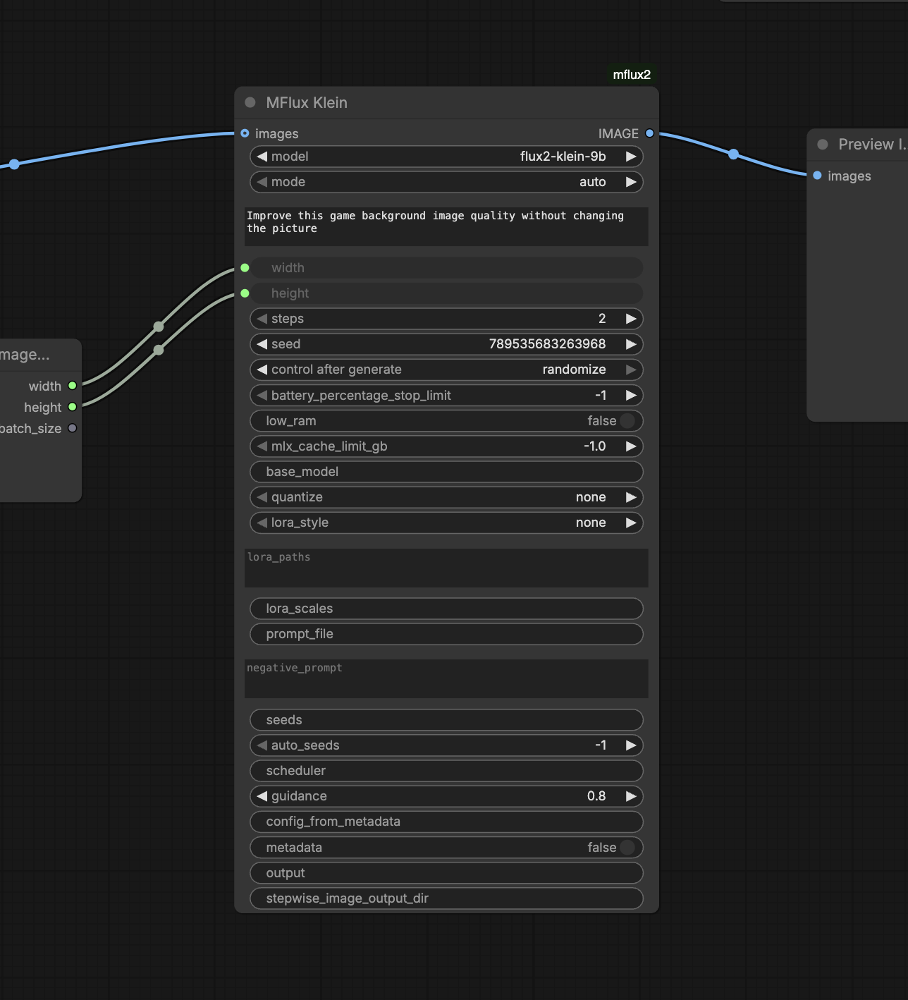
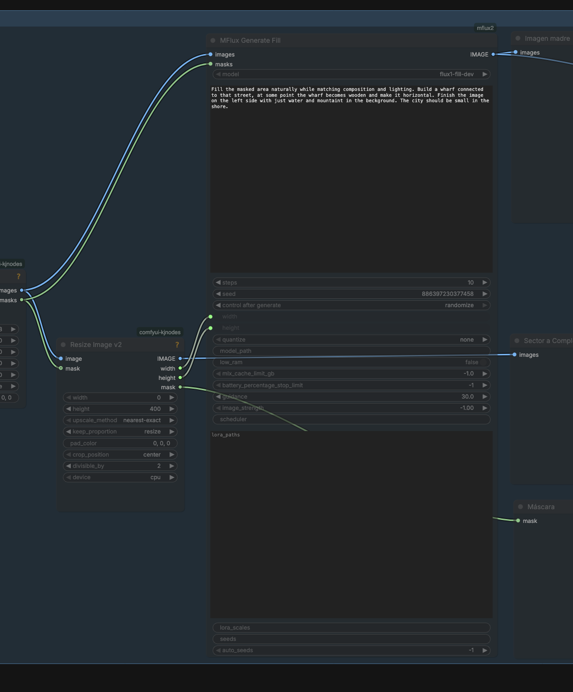
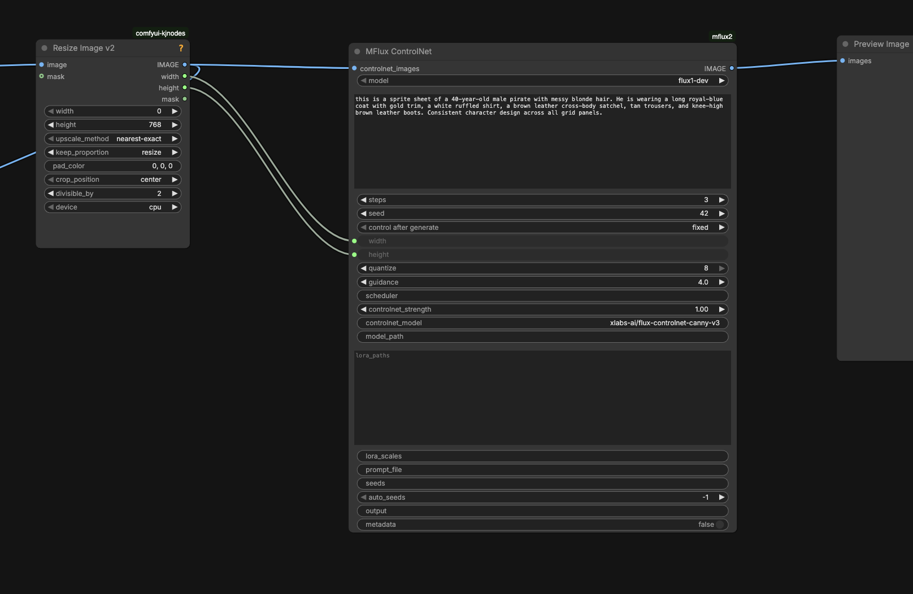
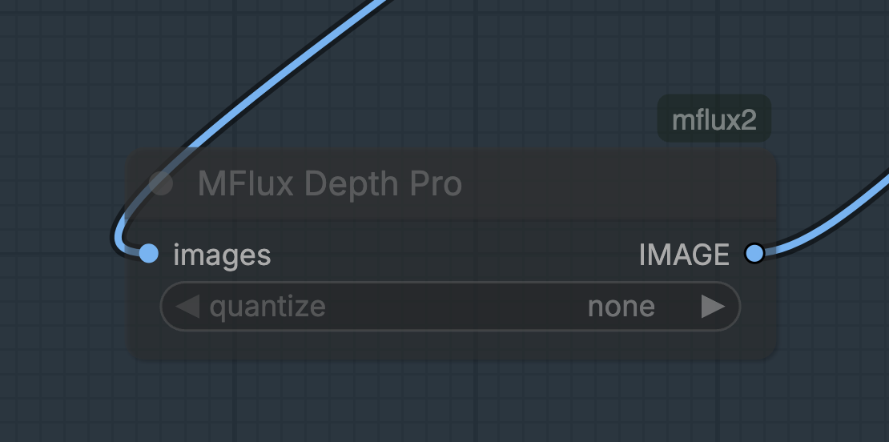

# ComfyUI-mflux2: ComfyUI MFlux Nodes with FLUX.2 support

This custom node pack is an updated version of the currently available MFlux node pack, now focused on exposing what is implemented today and explicitly supporting FLUX.2 workflows.

It is built on top of the mflux Python API, which is used here because these nodes are intended as a fast, Apple Silicon friendly path for image generation and editing (MLX-based, optimized for Apple architecture).



## Installation

1. Place this repository in your ComfyUI `custom_nodes` folder.
2. Install dependencies in the Python environment used by ComfyUI.
3. Restart ComfyUI and search for nodes under the `MFlux` categories.

Example dependency install:

```bash
pip install mflux torch numpy pillow
```

## Compatibility

- Primary target: macOS on Apple Silicon (M-series chips)
- Intended backend: mflux + MLX optimized paths
- ComfyUI integration: Python API usage, no CLI wrapper required

## Node screenshots

### MFlux Klein


### MFlux Generate Fill



### MFlux ControlNet



### MFlux Depth Pro



## Why this package exists

- Bring mflux model capabilities into ComfyUI nodes instead of shell-only CLI flows
- Prioritize fast local inference on Apple chips
- Expose FLUX.2 Klein generation/editing directly in graph workflows
- Keep node behavior aligned with the underlying API surface

## Available nodes (current)

- MFlux Klein (`MFluxKlein`)
- MFlux Depth Pro (`MFluxDepthPro`)
- MFlux Generate Fill (`MFluxGenerateFill`)
- MFlux Concept From Image (`MFluxConceptFromImage`)
- MFlux ControlNet (`MFluxControlNet`)

## Requirements

- Python package: `mflux` (with FLUX.2 support)
- Python deps: `torch`, `numpy`, `Pillow`
- ComfyUI `IMAGE` / `MASK` tensor inputs for image-conditioned nodes

Runtime notes:

- Depth Pro triggers an extra model download on first use (~1.9 GB)
- Some mflux-backed features download model weights the first time they are used

## FLUX.2 support status

This repository supports FLUX.2 today through:

- `MFluxKlein` using `Flux2Klein` and `Flux2KleinEdit`
- `MFluxGenerateFill` using FLUX.2 Klein edit variants for masked workflows

Supported FLUX.2 model options:

- `flux2-klein-4b`
- `flux2-klein-9b`
- `flux2-klein-base-4b`
- `flux2-klein-base-9b`

## Node details

### 1) MFluxKlein

Primary FLUX.2 generation/edit node.

Modes:

- `auto`: edit if `images` is connected, otherwise generate
- `generate`: always text-to-image (`Flux2Klein`)
- `edit`: always image-conditioned (`Flux2KleinEdit`, requires `images`)

Key options exposed:

- Prompting: `prompt`, `prompt_file`, `negative_prompt`
- Sampling: `steps`, `seed`, `seeds`, `auto_seeds`, `scheduler`, `guidance`
- Resolution: `width`, `height`
- Memory/perf: `low_ram`, `mlx_cache_limit_gb`, `battery_percentage_stop_limit`, `quantize`
- LoRA: `lora_style`, `lora_paths`, `lora_scales`
- Output/config: `config_from_metadata`, `metadata`, `output`, `stepwise_image_output_dir`

### 2) MFluxDepthPro

Depth map extraction node using `DepthPro`.

- Input: `images` (`IMAGE`, batch supported)
- Optional: `quantize` (`none`, `3`, `4`, `5`, `6`, `8`)
- Output: depth map as `IMAGE` (batch preserved)

### 3) MFluxGenerateFill

Mask-guided fill/inpaint style workflow.

- Required: `images` (`IMAGE`), `masks` (`MASK`), `prompt`, `steps`, `seed`, `width`, `height`
- Mask batch rule: mask batch must be `1` or match image batch size

Model behavior:

- `flux1-fill-dev`: runs native `Flux1Fill`
- FLUX.2 Klein variants: runs `Flux2KleinEdit` and composites result with the provided mask so only masked regions are replaced

### 4) MFluxConceptFromImage

Image-guided concept attention generation.

- Backend: `Flux1ConceptFromImage`
- Supported model configs: `schnell`, `dev`, `krea-dev` (alias `dev-krea`)
- Outputs:
  - `image` (generated image)
  - `heatmap` (concept attention map)
- Exposes: `concept`, `heatmap_layer_indices`, `heatmap_timesteps`, `guidance`, `image_strength`, etc.

### 5) MFluxControlNet

ControlNet-guided generation.

- Backend: `Flux1Controlnet`
- Supported model choices: `flux1-dev`, `flux1-schnell`
- Main input image socket: `controlnet_images`
- Notable options: `controlnet_model`, `controlnet_strength`, `quantize`, `guidance`, `scheduler`, `lora_paths`, `lora_scales`, `output`, `metadata`

CLI-style mapping example:

- `--model flux1-dev` -> `model=flux1-dev`
- `--controlnet-model ...` -> `controlnet_model`
- `--controlnet-image-path ...` -> `controlnet_images`
- `--steps` -> `steps`
- `--controlnet-strength` -> `controlnet_strength`

## List input format

For list-like text fields (`seeds`, `lora_paths`, `lora_scales`, layer/timestep lists), use space or comma-separated values.

Examples:

- `seeds`: `123 456 789` or `123,456,789`
- `lora_paths`: `/path/a.safetensors /path/b.safetensors`
- `lora_scales`: `0.6 0.8`
- `heatmap_layer_indices`: `15 16 17 18`

## Roadmap

Planned or potentially useful additions that are not currently exposed as dedicated nodes:

- [ ] Dedicated FLUX.2 edit node (separate from `MFluxKlein` mode switch)
- [ ] FLUX.2 training-oriented helpers/workflows
- [ ] Text-only concept attention node (`mflux-concept` equivalent)
- [ ] Redux workflows (`mflux-generate-redux`)
- [ ] Kontext workflows (`mflux-generate-kontext`)
- [ ] In-context LoRA workflows (`mflux-generate-in-context`)
- [ ] CatVTON workflows (`mflux-generate-in-context-catvton`)
- [ ] IC-Edit workflows (`mflux-generate-in-context-edit`)
- [ ] Extra utility/export nodes for mflux tool commands where practical

## Credits

- Upstream model/runtime and CLI inspiration: mflux by filipstrand
- FLUX.1/FLUX.2 model ecosystem: Black Forest Labs and related model contributors

## License

This project is licensed under GNU GPL v3.0 (`GPL-3.0-only`). See `LICENSE` at repository root for full terms.
